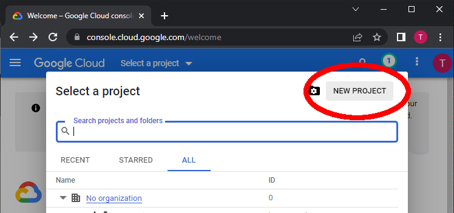
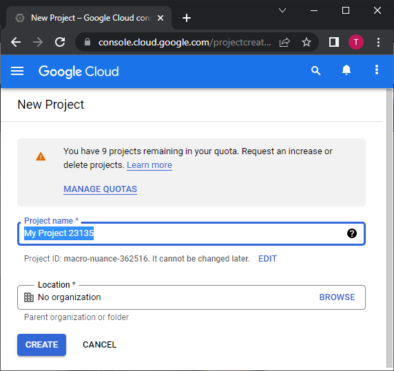
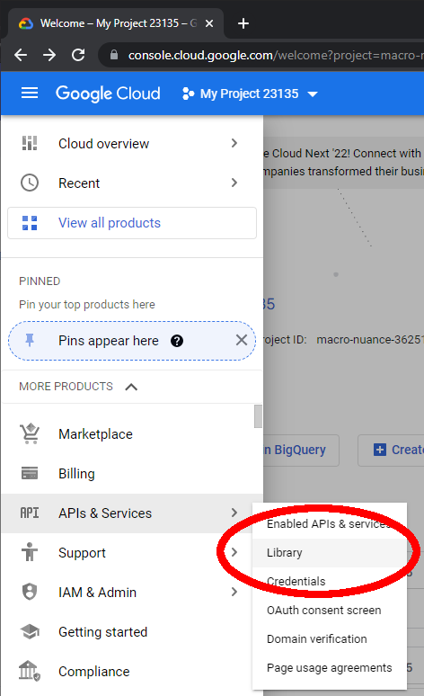
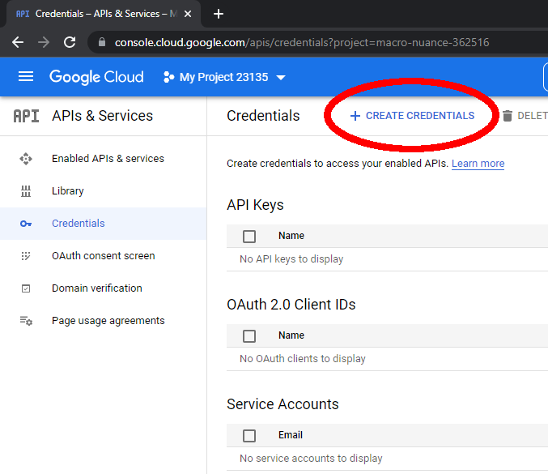

# EZSheets

A Pythonic interface to the Google Sheets API that actually works as of July 2024.

## Installation and Setup

To install with pip, run:

    pip install ezsheets

For your Python script to use EZSheets to access and edit your Google Sheets spreadsheets, you need a credentials JSON file and a token JSON file. If you have a Google/Gmail account, you can do this and it is free. I strongly recommend creating a new Google account instead of using your existing one, to prevent a bug in your Python script from affecting the spreadsheets in your personal Google account. There are five parts to creating credentials:

1. Create a new Google Cloud project.
2. Enable the Google Sheets API and Google Drive API for your project.
3. Configure the OAuth Consent Screen for your project.
4. Create credentials for your project.
5. Log in with the credentials file.

This may seem like a lot of work, but you only have to perform this setup once.

### Create a new Google Cloud Project

First, you need to set up a Google Cloud project. In your browser, go to https://console.cloud.google.com and sign in to your Google account with your username and password. (Your app can connect to any Google account, but this Google account will manage the Google API access for EZSheets.) You will be taken to a Getting Started page. At the top of the page, click on "Select a project". In the pop-up window that appears, click "New Project".

This takes you to a new project page. A Project Name like "My Project 23135" will be generated for you. There is also a Project ID like "macro-nuance-362516" randomly generated for you. These names won't be visible to users of your Python scripts and you can use whatever name you want. You can change the Project Name later but not the Project ID. I just use the default names that the website generates for me. You can leave the Location as "No organization". Free Google accounts can have up to 12 projects but you only need one project for all the Python scripts that you want to create. Click the blue "CREATE" button to create the project.

Click on "Select a project" at the top of the page again, and select the project you just created. You will be taken to the dashboard page for this Google Cloud Project. Next, you need to enable the Google Sheets API and Google Drive API for your project.

### Enable the Google Sheets API and Google Drive API for Your Project

On the https://console.cloud.google.com page, click on the Navigation button in the upper left (the icon is three horizontal stripes, often called the "hamburger" icon.) Navigate to "APIs & Services" and then "Library" to go to the API Library page. There are many Google APIs for Gmail, Google Maps, Google Cloud Storage, and other Google services. We need to allow our project to use the Google Sheets and Google Drive APIs.

Scroll down and find the "Google Sheets API" and click it, or enter "Google Sheets API" into the search bar to find it. This takes you to the Google Sheets API page. Click the blue "ENABLE" button to enable your Google Cloud project to use the Google Sheets API. You'll be redirected to the "APIs & Services > Enabled APIs & Services" page where you can find information about how often your Python scripts are using this API. Repeat this for the "Google Drive API" to enable it as well.

Next, you need to configure your project's OAuth Consent Screen.

### Configure the OAuth Consent Screen for Your Project

Click on the Navigation button in the upper left and then navigate to "APIs & Services" and then "OAuth Consent Screen." The consent screen will appear the first time when you or users of your Python script use EZSheets. With a free Google account that is not set up as a Google Workspace user, you'll have to select the External User Type option instead of Internal User Type. These are further explained on Google's [Setting up your OAuth consent screen help page](https://support.google.com/cloud/answer/10311615).

On Step 1 "OAuth consent screen", select External and click the blue "CREATE" button. The next page shows what the OAuth consent screen looks like. This screen appears to the user when they first import the ezsheets module. Pick a name for App Name (I use something generic like Python Google API Script) and enter your email address for the User Support Email and Developer Contact Information. Then click the "SAVE AND CONTINUE" button.

On Step 2 "Scopes", your projects' scopes are the permissions for what the project is allowed to access. Click the "ADD OR REMOVE SCOPES" button, and in the new panel that appears, go through the table and check the checkboxes for the scopes `.../auth/drive` (Google Drive API) and `.../auth/spreadsheets` (Google Sheets API) and click the blue "UPDATE" button. Then click "SAVE AND CONTINUE."

Step 3 "Test users" requires you to add the Gmail email addresses of the Google accounts that own the spreadsheets your Python script will interact with. Without going through Google's app approval process, your scripts are limited to interacting with the email addresses you provide in this step. Click the "+ ADD USERS" button and in the new panel that appears, enter the Gmail address of your Google account and click the blue "ADD" button. Then click "SAVE AND CONTINUE."

Step 4 "Summary" provides a summary of the previous steps. If all the information looks right, click the "BACK TO DASHBOARD" button. The next step is to create credentials for your project.

### Create Credentials for Your Project

From the Navigation sidebar menu, click on "APIs & Services" and then "Credentials" to go to the Credentials page. Click the "+ CREATE CREDENTIALS" link at the top of the page. A submenu will open asking what kind of credentials you want to create: "API key", "OAuth client ID", or "Service account". Click on "OAuth client ID".

On the new page that appears, select "Desktop app" for the "Application type" and leave "Name" as the default "Desktop client 1." (You can change this to a different name if you want, it doesn't appear to the users of your Python script.) Click the blue "CREATE" button.

On the pop up that appears, click "DOWNLOAD JSON" to download the credentials file. This credentials JSON file will have a name like *client_secret_282792235794-p2o9gfcub4htibfg2u207gcomco9nqm7.apps.googleusercontent.com.json*. Place it in the same folder that your Python script will be in.

### Log In with the Credentials File

Run the Python interactive shell from the same folder that the credentials JSON file is in and run `import ezsheets`. Or, place a *.py* Python program in this folder and have it run `import ezsheets`. EZSheets will load and automatically check this folder for a credentials JSON file and, if found, launches your web browser to the OAuth consent screen. Sign in with the Google account you want to access from your Python script. This must be the same email address that you gave for the "test user" when configuring the Google Cloud project's OAuth consent screen.

You will get a warning message that reads "Google hasn't verified this app," but that's fine because this is the app (or project) that you've just created yourself. Click the Continue link. You'll come to another page that says "Python Google API Script wants access to your Google Account" (or whatever name you gave in the OAuth consent screen setup.) Click Continue.

You'll come to a plain web page that says, "The authentication flow has completed." You can now close the browser window. In the same folder as your credentials JSON file, you'll now see a *token-drive.pickle* and *token-sheets.pickle* file. Treat these files like passwords and do not share them: they can be used to log in and access your Google Sheets spreadsheets.

## Quickstart Guide

After you've set up your credentials and token files, you can import EZSheets to access your Google Sheets. Create a `Spreadsheet` object by using the Spreadsheet's URL:

    >>> import ezsheets
    >>> s = ezsheets.Spreadsheet('https://docs.google.com/spreadsheets/d/16RWH9XBBwd8pRYZDSo9EontzdVPqxdGnwM5MnP6T48c/edit#gid=0')

You can also just provide the spreadsheet ID part of the URL:

    >>> s = ezsheets.Spreadsheet('16RWH9XBBwd8pRYZDSo9EontzdVPqxdGnwM5MnP6T48c')

`Spreadsheet` objects have a `title` and `spreadsheetId` attributes:

    >>> s.title
    'Class Data Example'
    >>> s.title = 'Class Data'
    >>> s.title
    'Class Data'
    >>> s.spreadsheetId
    '16RWH9XBBwd8pRYZDSo9EontzdVPqxdGnwM5MnP6T48c'

`Spreadsheet` objects also have a `sheets` attribute, which is a list of `Sheet` objects:

    >>> s.sheets
    (Sheet(title='Sheet3', sheetId=314007586, rowCount=1000, columnCount=26), Sheet(title='Foobar', sheetId=2075929783, rowCount=1000, columnCount=27), Sheet(title='Class Data', sheetId=0, rowCount=101, columnCount=22, frozenRowCount=1), Sheet(title='Sheet2', sheetId=880141843, rowCount=1000, columnCount=26))
    >>> s.sheetTitles
    ('Sheet3', 'Foobar', 'Class Data', 'Sheet2')
    >>> sh = s.sheets[0]

You can then view the size and title of a sheet:

    >>> sh = s.sheets[0]
    >>> sh.title
    'Sheet3'
    >>> sh.title = 'My New Title'
    >>> sh.title
    'My New Title'
    >>> sh.columnCount, sh.rowCount
    (26, 1000)

You can also get or update data in a specific cell, row, or column:

    >>> sh.get(1,1)
    'fads'
    >>> sh.update(1, 1, 'New cell value')
    >>> sh.getRow(1)
    ['New cell value', 'fe', 'fa', 'ewafwe', 'f', 'ew', 'ewafawef', 'ewf', 'ewf', 'ew', 'fewa', 'f', 'ew', '', '', '', '', '', '', 'ewf', 'ewafewaf', 'ewfewf', '', 'f', 'ewfewafewaf', 'ewfew']
    >>> sh.updateRow(['cell A', 'cell B', 'cell C'])
    Traceback (most recent call last):
      File "<stdin>", line 1, in <module>
    TypeError: updateRow() missing 1 required positional argument: 'values'
    >>> sh.updateRow(1, ['cell A', 'cell B', 'cell C'])
    >>> sh.getColumn(1)
    ['cell A']
    >>> sh.update(1, 2, 'another value')
    >>> sh.getColumn(1)
    ['cell A', 'another value']
    >>> sh.updateAll([['CELL A', 'ANOTHER VALUE', 'CELL C'], ['ANOTHER VALUE']])
    >>> sh.getRows()
    [['CELL A', 'ANOTHER VALUE', 'CELL C'], ['ANOTHER VALUE']]

If the data on the Google Sheet changes, you can refresh your local copy of the data:

    >>> sh.refresh() # Updates the Sheet object.
    >>> s.refresh()  # Updates the Spreadsheet object and all its sheets.

You can rearrange the order of the sheets in the spreadsheet:

    >>> s.sheetTitles
    ('My New Title', 'Foobar', 'Class Data', 'Sheet2')
    >>> s.sheets[0].index
    0
    >>> s.sheets[0].index = 2
    >>> s.sheetTitles
    ('Foobar', 'Class Data', 'My New Title', 'Sheet2')
    >>> s.sheets[2].index = 0
    >>> s.sheetTitles
    ('My New Title', 'Foobar', 'Class Data', 'Sheet2')

You can recolor the tabs as well. (Currently you can't reset the tab color back to no color.)

## Contribute

If you'd like to contribute to EZSheets, check out https://github.com/asweigart/ezsheets

## Support

If you find this project helpful and would like to support its development, [consider donating to its creator on Patreon](https://www.patreon.com/AlSweigart).
